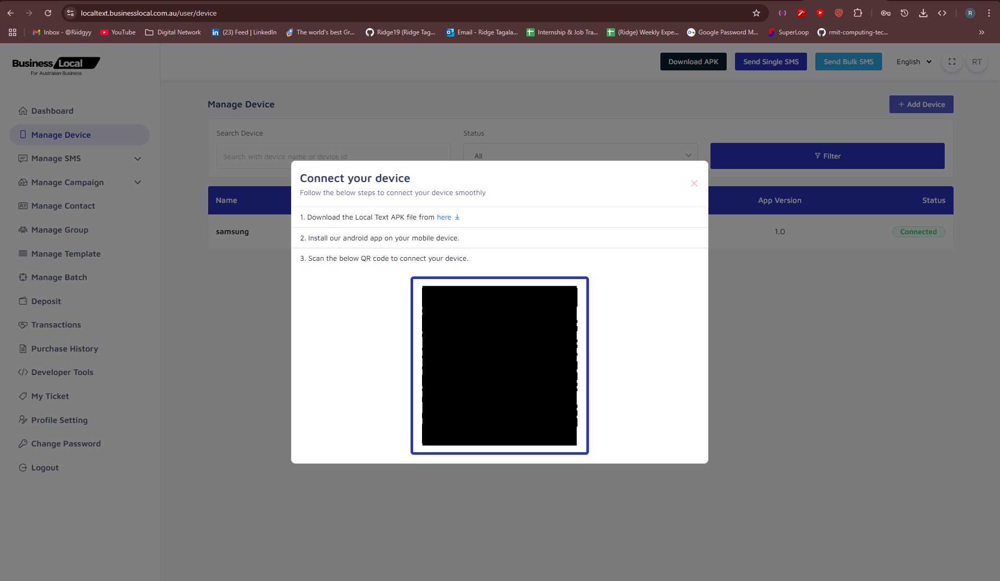
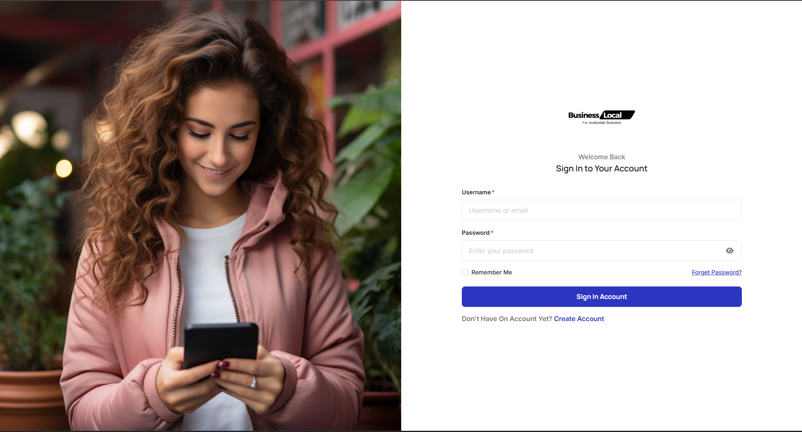

# Local Text Android App

Local Text is an Android application developed for @businesslocal that enables businesses to send and manage SMS notifications using their own Android devices as SMS gateways. The app is designed for seamless integration with the Local Text web platform, allowing users to connect their devices via QR code and manage SMS campaigns, contacts, and templates from a central dashboard.

## Features

- **Device Pairing via QR Code:**
  - Securely connect your Android device to your Local Text account by scanning a QR code from the web dashboard.
- **SMS Sending & Receiving:**
  - Send single or bulk SMS messages directly from your device.
  - Receive and upload incoming SMS to the platform.
- **Campaign & Contact Management:**
  - Manage SMS campaigns, contacts, groups, and templates from the web dashboard.
- **Device Management:**
  - View, add, or remove connected devices. Enforce device limits per user.
- **Authentication & Security:**
  - Login with username/email and password.
  - OTP-based password recovery.
  - "Remember Me" option for persistent device pairing.
- **Session Management:**
  - Logout and session handling with automatic redirection to the login screen.
  - Option to forget device when "Remember Me" is unticked.
- **SIM Slot Support:**
  - Detect and use multiple SIM slots for sending SMS.

## How It Works

1. **Download & Install:**
   - Download the Local Text APK from the web dashboard and install it on your Android device.
2. **Pair Device:**
   - Log in to the web dashboard, go to "Add Device", and scan the QR code using the app.
3. **Send SMS:**
   - Use the web dashboard to send SMS via your paired device(s).
4. **Manage Devices:**
   - Add, remove, or monitor devices from the dashboard. Device limits are enforced for each user.
5. **Authentication:**
   - Use the "Remember Me" option to keep your device paired, or untick to remove the connection on logout.

## Screenshots

## Tech Stack
- Java (Android)
- Retrofit2 (API calls)
- ZXing (QR code scanning)
- Toasty (User notifications)
- Material Design UI

## Contributors
- [@Ridge19](https://github.com/Ridge19) (Developer)
- [@businesslocal](https://github.com/businesslocal) (Organisation)

## License
This project is proprietary and developed for @businesslocal. For licensing or business inquiries, please contact the organisation directly.

---

For more information, visit [localtext.businesslocal.com.au](https://localtext.businesslocal.com.au) or contact [@Ridge19](https://github.com/Ridge19).

